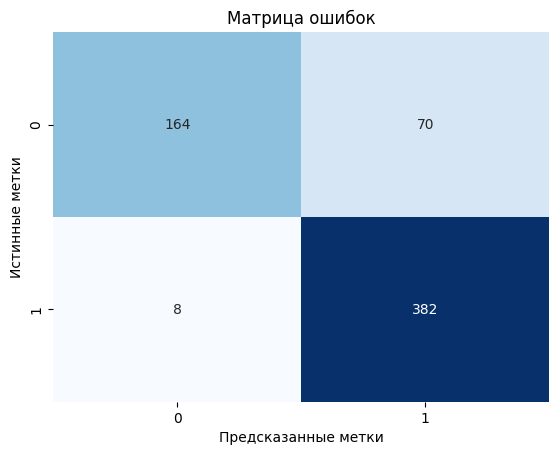

# Классификация рентгеновских снимков

Целью является создание модели прогнозирования — для классификации рентгеновских снимков грудной клетки, на здоровые (Normal) и имеющие пневмонию (Pneumonia)

**Особенности датасета:**
- **Два класса:** Normal / Pneumonia.
- **Объем:** ~5,800 изображений.
- **Дисбаланс классов:** Количество снимков с пневмонией значительно превышает количество снимков здоровых пациентов.

## Технологический стек
- **Python**
- **TensorFlow / Keras**: Основной фреймворк для построения и обучения модели.
- **Scikit-learn**: Для расчета и анализа метрик производительности.
- **NumPy**: Для численных операций.
- **Matplotlib & Seaborn**: Для визуализации данных и результатов.
- **KaggleHub**: Для загрузки датасета.
- **VS Code**: Среда для разработки и документирования.

## Содержание проекта

### 1. Подготовка и анализ данных (EDA)
- **Создание репрезентативной валидационной выборки**
- **Анализ дисбаланса**

### 2. Аугментация данных
Для повышения устойчивости модели и предотвращения переобучения была применена аугментация данных:
- Случайные повороты
- Случайные сдвиги
- Случайное масштабирование

### 3. Разработка и обучение модели
Было протестировано несколько архитектур. Однако наилучшие результаты показала  сверточная нейронная сеть (CNN), построенная с нуля.

**Ключевые особенности финальной архитектуры:**
- Модель использует одноканальные изображения для рентгеновских снимков и снижает сложность.
- Первый слой `Conv2D` для базовых признаков, а последующие — `SeparableConv2D` для эффективности и снижения количества параметров.
- Использование `BatchNormalization` для стабилизации обучения и `Dropout` для борьбы с переобучением.
- Слой `Rescaling` делает модель самодостаточной.

### 4. Контроль обучения
Для автоматизации и оптимизации процесса обучения использовались стандартные коллбеки:
- `ModelCheckpoint`: Сохранение лучшей версии модели.
- `EarlyStopping`: Предотвращение переобучения путем ранней остановки.
- `ReduceLROnPlateau`: Адаптивное снижение скорости обучения.

## Результаты

Финальная модель была оценена на тестовой выборке и показала следующие результаты:

- **Test Accuracy:** **87.5%**
- **Test Loss:** 0.335

**Анализ по классам:**
| Класс | Precision | Recall | F1-Score |
|---|---|---|---|
| NORMAL | 0.95 | 0.70 | 0.81 |
| PNEUMONIA | 0.85 | 0.98 | 0.91 |

**Матрица ошибок:**

**Выводы из результатов:**
- Модель достигла высокой общей точности.
- **Recall 98%** для класса "Pneumonia" означает, что модель успешно обнаружила почти все случаи заболевания, минимизировав количество самых опасных ошибок (False Negatives).
- **Precision 95%** для класса "Normal" говорит о высокой надежности диагноза "здоров".
